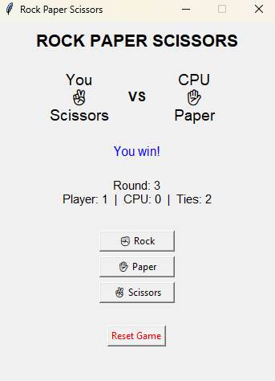

# Rock Paper Scissors - Python Desktop App

i built a simple Rock Paper Scissors game with a graphical user interface (GUI) built entirely using the `tkinter` library.

## How the Game Works
It's you against the computer in a "Best of 5" match (first to 3 points wins). 
- Rock ✊ beats Scissors ✌️
- Scissors ✌️ beats Paper ✋
- Paper ✋ beats Rock ✊

## Features
- Fully interactive desktop GUI.
- "Best of 5" match system with clear win-loss declarations.
- Real-time score and round tracking.
- Modular code architecture separating game logic from GUI rendering.

## How to Run It
1. Ensure Python 3.9 or higher is installed on your machine.
2. Clone this repository.
3. Run the script from your terminal:
   `python rock_paper_scissors.py`

## Screenshots

## What I Learned
Through this project, I strengthened my ability to decouple pure logic (determining the winner) from presentation code (updating labels on a screen). I also learned how to manage application state safely without relying on messy global variables.

## Possible Future Improvements
- Keyboard bindings (e.g., pressing 'R' for Rock).
- Storing match history or high scores in a local `.txt` or `.json` file.